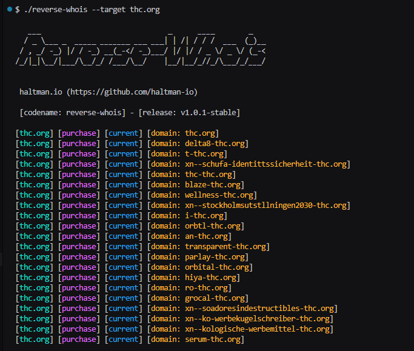
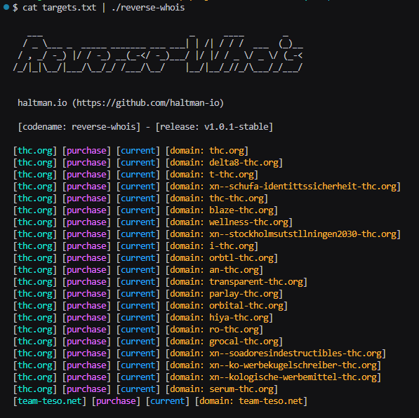
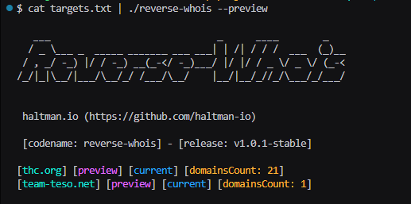
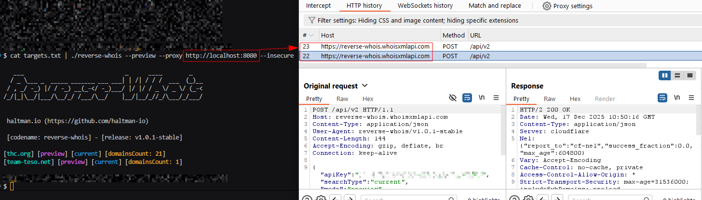

# reverse-whois

Production-grade CLI tool to perform **Reverse WHOIS** queries and enumerate domains whose WHOIS records contain specific **search terms**. Built for cybersecurity analysts, threat intel workflows, OSINT enrichment, and vendor/brand footprint discovery using a commercial data provider API.

Repository: [https://github.com/haltman-io/reverse-whois](https://github.com/haltman-io/reverse-whois)

---

## Why this exists

In security investigations and due diligence, you often start with a single reference point (e.g., a known domain, brand, organization name, email, or unique string) and need to identify **other related domains** that share that term somewhere in WHOIS data. Reverse WHOIS enables that pivot efficiently using indexed WHOIS datasets (current and optionally historic records).

This tool focuses on:

* **Repeatable CLI usage**
* **Greppable / pipeline-friendly output**
* **Safe defaults**
* **Proxy + concurrency + rate limiting** controls for operational environments

---

## Features

* Reverse WHOIS search by **term** (single or multiple targets)
* Supports **current** and **historic** WHOIS search modes
* Supports **preview** (count only) and **purchase** (domains list) modes

  * **Default request mode is `purchase`** (even though the API defaults to `preview`)
* Multiple target input methods:

  * `stdin` / pipeline
  * `--target/-t` (repeatable and comma-separated)
  * `--target-list/-tL` (repeatable and comma-separated file paths)
* Exclusion filter support:

  * `--exclude/-e` (repeatable and comma-separated)
  * **max 4 exclude items** (API constraint)
* **API key management**

  * `--api-key <KEY>` takes priority
  * fallback YAML config near the executable: `.reverse-whois.yaml`
  * supports **multiple keys** and **round-robin rotation** per request
* Proxy support:

  * HTTP/HTTPS and SOCKS5 via `--proxy`
  * `--no-proxy` to ignore env vars
  * respects `HTTP_PROXY`, `HTTPS_PROXY`, `NO_PROXY` unless `--no-proxy`
* TLS bypass for lab environments:

  * `--insecure/-k` disables TLS verification (curl-style)
* Concurrency:

  * `--threads <n>` worker pool execution
* Rate limiting:

  * `--rate-limit/-rl <rps>` global max requests/second across all threads
  * API hard limit: **30 rps** (tool rejects values > 30)
* Output options:

  * colored terminal output (ANSI), disable with `--no-color`
  * `--output/-o/-out <file>` writes **clean results** (no ANSI, deduplicated)
* Logging controls:

  * `--silent/--quiet` suppress banner/logs (results still printed)
  * `--verbose/--debug` enable debug logging (stderr)

---

## Screenshot / Demo

Basic usage:


Pipeline usage:


Preview (It does not consume API credits):


Proxy usage:


---

## Data source / API

**Native endpoint**:

* `https://reverse-whois.whoisxmlapi.com/api/v2`

**Required header**:

* `Content-Type: application/json`

**Request fields used by this tool**:

* `apiKey` (**required**)
* `basicSearchTerms.include` (**required**, max 4 items; tool uses a single term per request)
* `basicSearchTerms.exclude` (optional, max 4 items)
* `searchType` (`current` or `historic`; default `current`)
* `mode` (`preview` or `purchase`; tool default `purchase`)
* `punycode` (set to `true`)

---

## Output format

Terminal output is structured and greppable:

```
[$SEARCH_TERM] [$MODE] [$SEARCH_TYPE] [$Key: $Value]
```

### Preview mode example

Command:

```bash
reverse-whois -t thc.org --preview --history
```

Output:

```text
[thc.org] [preview] [historic] [domainsCount: 42]
```

### Purchase mode example

Command:

```bash
reverse-whois -t thc.org --history
```

Output:

```text
[thc.org] [purchase] [historic] [domain: an-thc.org]
[thc.org] [purchase] [historic] [domain: instituto-thc.org]
...
```

---

## Output to file (`--output/-o/-out`)

When `--output` is set, the tool still prints normal output to stdout, but the output file is written in a **clean, tool-friendly format**:

* **No ANSI colors**
* **Deduplicated**
* **Purchase mode**: one domain per line
* **Preview mode**: `term<TAB>count` per request (to keep multi-target output unambiguous)

Example:

```bash
reverse-whois -t thc.org --history --output out.txt
```

`out.txt`:

```text
an-thc.org
instituto-thc.org
xn--stockholmsutstllningen2030-thc.org
...
```

**Overwrite behavior**: if the file exists, it is **overwritten**.

> Note: The tool does **not** create parent directories. If the path is invalid, it exits with an error.

---

## Installation

### Requirements

* Go **1.22+**

### Option A) Build from source (recommended)

```bash
git clone https://github.com/haltman-io/reverse-whois.git
cd reverse-whois
go mod tidy
go build -o reverse-whois ./cmd/reverse-whois
./reverse-whois -h
```

### Option B) Install to `$GOBIN`

```bash
go install github.com/haltman-io/reverse-whois/cmd/reverse-whois@latest
reverse-whois -h
```

If the binary is not found, ensure:

* `$GOBIN` or `$(go env GOPATH)/bin` is in your `PATH`.

---

## Configuration: API keys (`.reverse-whois.yaml`)

On startup, the tool checks for a YAML file **next to the executable**:

* `.reverse-whois.yaml`

If it does not exist, it is created automatically with:

```yaml
api_keys: []
```

### API key resolution priority

1. If `--api-key <KEY>` is provided → used for all requests.
2. Else, the tool reads `.reverse-whois.yaml`:

   * if `api_keys` is empty → exits with an error
   * if it contains multiple keys → keys are **rotated round-robin** per request

---

## Usage

### Flags

**Targets**

* `--target, -t <target>`
  Define a search term target (repeatable; supports comma-separated values).
* `--target-list, -tL <file>`
  Define a file containing targets (repeatable; supports comma-separated paths).
* `stdin` / pipeline
  Provide targets via pipe: `cat targets.txt | reverse-whois`

**API**

* `--api-key <API_KEY>`
  Provide an API key directly (takes priority over YAML).

**Search type**

* `--history` (alias: `--historic`)
  Sets `searchType=historic`. Default is `current`.

**Mode**

* `--preview` (alias: `--check`)
  Sets `mode=preview` (count only). Default is `purchase`.

**Exclude terms**

* `--exclude <term>` (alias: `-e`)
  Adds term(s) to `basicSearchTerms.exclude`.
  Repeatable and comma-separated. **Maximum 4 items**.

**Proxy / TLS**

* `--proxy <url>`
  Supports: `http://`, `https://`, `socks5://`
* `--no-proxy`
  Ignore proxy environment variables.
* `--insecure, -k`
  Skip TLS certificate verification.

**Concurrency / rate limit**

* `--threads <n>`
  Worker count (default: **1**).
* `--rate-limit <rps>, -rl <rps>`
  Global max requests/second across all threads.
  Must be `>= 1` and `<= 30`.

**Output / logging**

* `--output <path>, -o <path>, -out <path>`
  Write clean results to a file (overwrite).
* `--silent, -s` / `--quiet, -q`
  Results only (no banner/logs).
* `--verbose, -v` / `--debug`
  Enable debug logs (stderr).
* `--no-color, -nc`
  Disable ANSI color output.

---

## Input formats

### 1) Single target

```bash
reverse-whois -t thc.org
```

### 2) Multiple `-t` targets

```bash
reverse-whois -t thc.org -t example.com
```

### 3) Comma-separated targets

```bash
reverse-whois -t thc.org,example.com
```

### 4) List files (`-tL`)

```bash
reverse-whois -tL targets1.txt -tL targets2.txt
reverse-whois -tL targets1.txt,targets2.txt
```

### 5) Pipeline / stdin

```bash
cat targets.txt | reverse-whois
cat targets.txt | reverse-whois --history
```

### 6) Exclude term variants

```bash
reverse-whois -t thc.org -e freejulian.org
reverse-whois -t thc.org -e freejulian.org,example.net
reverse-whois -t thc.org -e a -e b -e c -e d
```

If you exceed 4 exclude items, the tool exits with an error.

---

## Proxy examples

### HTTP proxy

```bash
reverse-whois -t thc.org --proxy http://127.0.0.1:8080
```

### HTTPS proxy

```bash
reverse-whois -t thc.org --proxy https://127.0.0.1:8443
```

### SOCKS5 proxy

```bash
reverse-whois -t thc.org --proxy socks5://127.0.0.1:9050
```

### Ignore environment proxies

```bash
reverse-whois -t thc.org --no-proxy
```

### TLS bypass (dangerous)

```bash
reverse-whois -t thc.org --proxy http://127.0.0.1:8080 -k
```

> **Warning:** `--insecure/-k` disables TLS verification. Use only when you understand the security implications.

---

## Concurrency & rate limiting examples

### Threads

```bash
reverse-whois -t thc.org --threads 5
```

### Rate limit (global across all threads)

```bash
reverse-whois -t thc.org -rl 10
```

> `--rate-limit` is global across all workers. It is **not per-thread**.

### Threads + rate-limit together

```bash
reverse-whois -t thc.org --threads 10 -rl 30
```

If you set `-rl` above 30, the tool exits with an error.

---

## Error handling

The tool provides direct, user-facing HTTP error messages based on API responses:

* `400 Bad Request`: missing/invalid request fields
* `401 Unauthorized`: missing/invalid API key
* `403 Forbidden`: access restricted / credits / invalid key
* `408 Request Timeout`: provider timeout
* `410 Gone`: API version deprecated
* `422 Unprocessable Entity`: invalid parameters or search term
* `429 Too Many Requests`: rate-limited
* `5XX`: provider internal error (contact support)

---

## Security & privacy notes

* Use this tool only for authorized investigations and legitimate security workflows.
* This tool outputs domains returned by a commercial provider. Avoid unnecessary data collection and follow your org’s policies.
* API keys are sensitive credentials. Prefer environment isolation and do not commit keys to Git.

---

## Contributing

### Development setup

```bash
git clone https://github.com/haltman-io/reverse-whois.git
cd reverse-whois
go mod tidy
```

### Project layout

* `cmd/reverse-whois/` — CLI entrypoint (wiring only)
* `internal/cli/` — flags, config, usage
* `internal/targets/` — target collection, parsing, dedupe
* `internal/api/` — HTTP client, request/response models
* `internal/ratelimit/` — global limiter utilities
* `internal/output/` — banner, colors, formatters/printer
* `internal/util/` — shared helpers (logging, YAML, writers)

### Guidelines

* Keep comments, identifiers, and logs in **English**
* Prefer small, testable functions
* Avoid breaking output format without documenting changes
* If adding new providers/endpoints, keep `internal/api/` modular and avoid leaking provider logic into unrelated packages

### Pull Requests

* Provide a clear summary and motivation
* Include before/after output examples if formatting changes
* Update README when behavior changes

---

## Vulnerability Reporting (Security)

If you discover a security issue in this repository:

1. **Do not open a public GitHub issue.**
2. Send a report with:

   * a clear description of the issue
   * impact assessment
   * reproduction steps / PoC (if applicable)
   * suggested remediation
3. Contact:

   * Create a private advisory (recommended) via GitHub Security Advisories (if enabled), **or**
   * Email the maintainers: `security@haltman.io`

---

## License

This project is licensed under the Unlicense, see the [LICENSE](LICENSE) file for details.